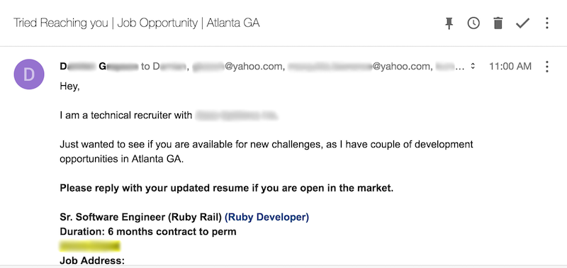

Yet another email from yet another recruiter, today. This is one more email sent to an address I haven't used since 2014. If their sources of information really 3 years old, why are they pinging me about my work with Ruby on Rails? 3 years ago I wasn't publicly posting any such interest online.

How are they getting this information? I'm not certain, but I suspect it's scraping Github's API. Either way it's getting really fricking annoying. Let me tell you why:

## Security

Too many websites out there, these days, accept email addresses as a person's username. While this particular issue isn't the fault of the recruiter sending this email, despite them more than likely pulling my email from GitHub [against their terms of use][gh-recruiter-email], it is the fault of many login systems.

Without multi-factor authentication enabled on all accounts with an email that _can_ act as the username, a potential attacker already has one piece of the keys to your account. In most cases which involve a cooling-off period between failed login attempts, it's just a waiting game for an attacker to brute-force your account password. If you work on an application with a login system like this, use whatever sway you can to enable a lockout system requiring password reset, not a cooling off period.

For an email account, requiring a password reset wouldn't make sense. Where would you send the reset request, via email? No, in this case a cooling off period makes sense and a user should always, _always_, _ALWAYS_ have some form of multifactor authentication enabled. For any other service, it doesn't make sense.

As a programmer, I get it. Finding a unique, memorable key for someone to use as one half of their authentication mechanism makes sense. The username/password approach is ingrained in the user experience for most internet goers. An efficiency gain is to use their email address as a string acting as their username, right? Then you can guarantee it's unique (pending validation by clicking a confirmation link in a welcome email) and won't have to validate uniqueness as a database constraint, right? Wrong.

Okay, security aside. Let's assume I have multi-factor authentication on everything that uses the concerned email address. What else might be a problem?

[gh-recruiter-email]: https://docs.github.com/en/github/site-policy/github-acceptable-use-policies#6-information-usage-restrictions

## Reply-all

This email keeps coming. Notice the list of recipients? The fact that I can see them means the sender didn't use the BCC field, as is convention. If you haven't been part of a reply-all rage-fest, I do not recommend it. One recipient hits reply-all because maybe the opportunity interests them, maybe they're being a good netizen and replying to every email inquiry they receive, or maybe they have a vacation responder set for _every_ incoming email. If multiple vacation responders do what they're intended? You have an exponentially growing chain of responses. Hopefully it's just 2 auto-responders, in that event.

Okay, no one has vacation responders setup to reply to anyone in this case. What's wrong with the TO or CC field? Do you remember the Github API abuse mentioned earlier? Anyone else who received that email is able to pull in every other address on the list into their own, spammy sales pipeline. And the cycle continues...
